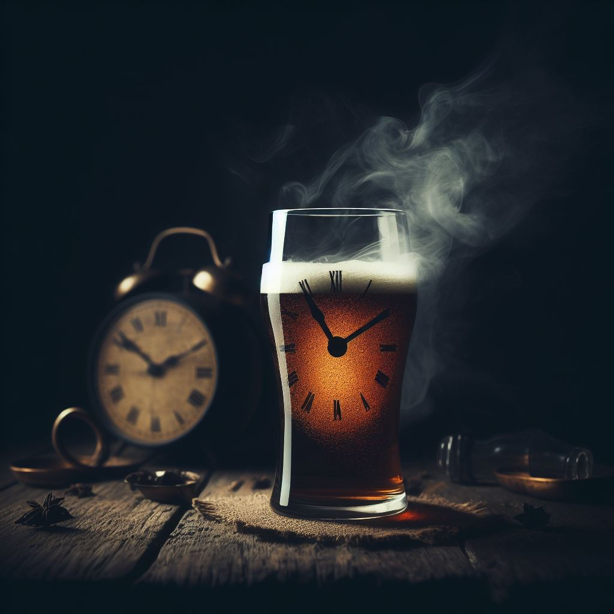

# Kaljakello (Beer Clock)

This repo contains the implementation of a multiplatform (Android + iOS)
mobile app for tracking blood alcohol concentration based on recorded
alcohol consumption. It can be used to give you an estimate for how long
it takes for your body to clear out the remaining alcohol. Please note
that the app can only calculate an estimation based on the generally
available alcohol calculation formulas. For more accurate results you
must use a proper blood alcohol measuring tool.

This project is based on the Jetpack Compose Multiplatform project, and
it has been created from their
[project template](https://github.com/JetBrains/compose-multiplatform-template).

 
_Illustration courtesy of DALL-E 3 via Bing_ 
_Prompt: dark and moody image of a beer glass as a clock with the time slowly ticking away_
